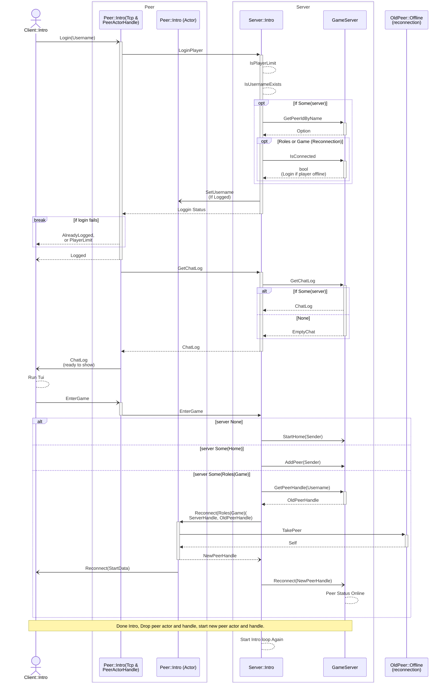
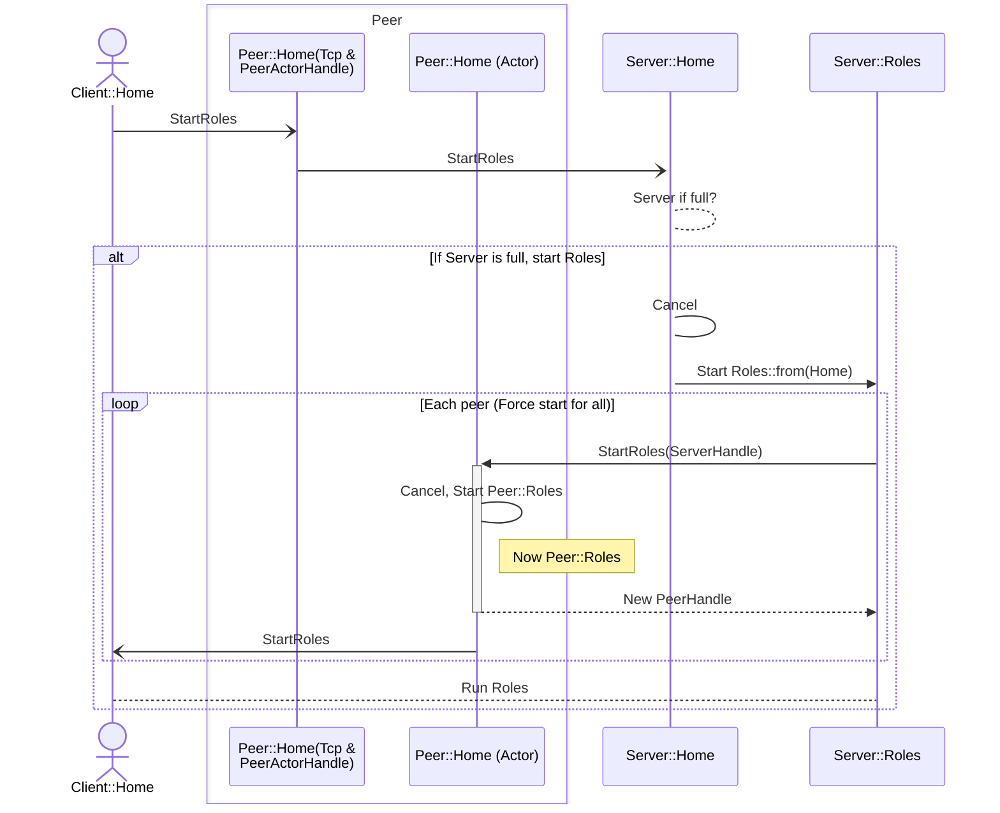
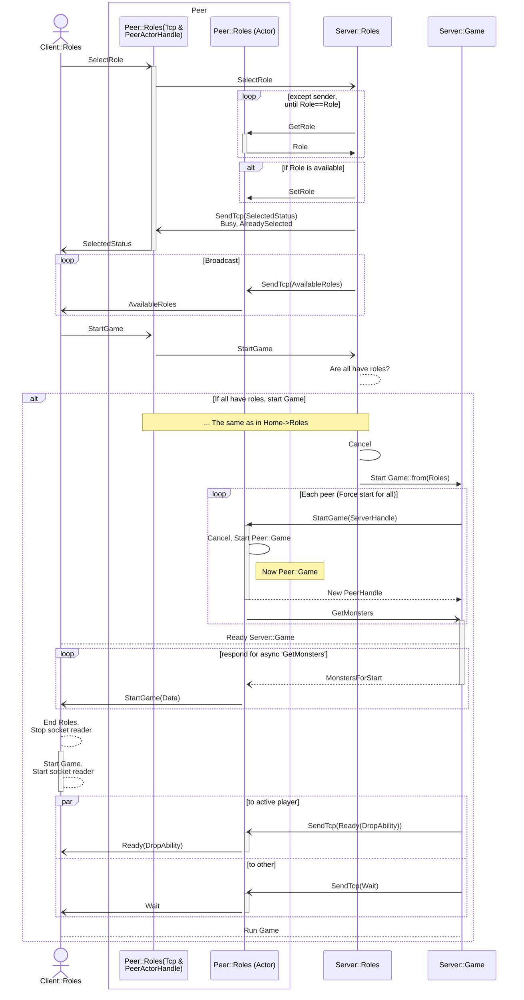
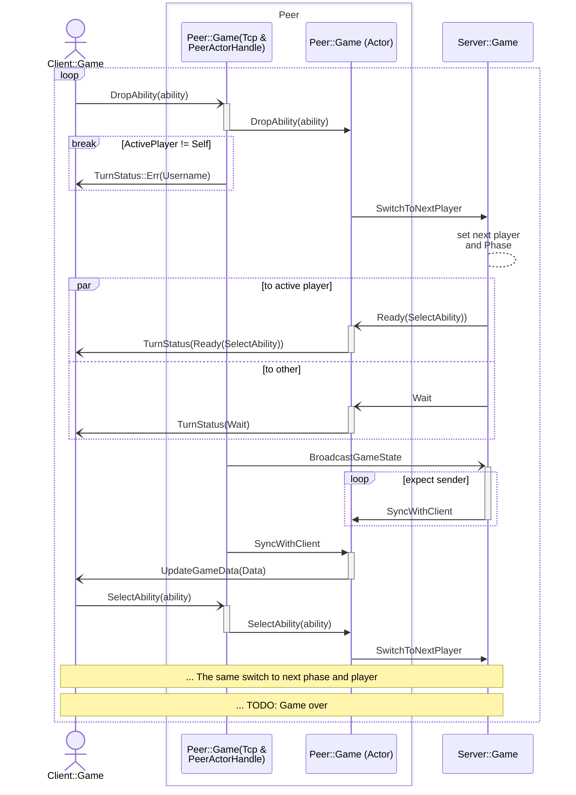

# Kobuleti

## About 
Kobuleti is an rpg game about the village Kobuleti in Adjaria(Georgia) near Batumi where we lived in summer.

## Goals
The indent of this project is my initial expirience in Rust and async web apps development. While a build this game I ...

## Key Features
- Terminal based (with [ratatui])
- State machine actors built with pure [tokio]
- Login (simple, only by username)
- Reconnection
- Chat (saving between reconnections, while a game session is running)
- 2 players multiplayer together against monsters
- Turn-based

[ratatui]: https://docs.rs/ratatui/latest/ratatui/
[tokio]: https://tokio.rs


## Implementation
The client-server communication is simple. It works over tcp with serde::json and LinesCodec, which splits stream by '\0'. Client app wait an input or tcp event and then

### Actors with Tokio
The server of this game is split on different part: 'Peer' for 'accept connection' code and 'States' for common server part. The server does not use any Mutex or Rwlocks. Parts of the server based on 'Actor' pattern with only raw 'Tokio' as described in the [Alice Ryhl]'s article [Actors with Tokio]. The server only uses mpsc and oneshot channels to communicate between peer actors and the server actor.

[Actors with Tokio]: https://ryhl.io/blog/actors-with-tokio/


An actor splitted for an Actor and an actor Handle. An actor runs in own tokio task and listen on tokio::mpsc::channel receiver. Other parts of the server use handle for send enum messages, and receive return value through tokio::sync::oneshot::channel.

Also a handle of peer used for accept tcp connection messages and reduce it to its peer actor, or the server actor. It allows to avoid cycle  infinite awaiting leak.

For simplify defining actor api I make a macro with tt-muncher: 
```rust
actor_api! { // Peer::Intro
    impl  Handle<Msg<SharedCmd, IntroCmd>>{
        pub async fn set_username(&self, username: Username);
        pub async fn enter_game(&self, server: states::HomeHandle) -> Result<HomeHandle, RecvError>;
    }
}
```
The macro automatically defining inner enum and methods:
```rust
 enum IntroCmd {
    SetUsername(Username),
    EnterGame(tokio::sync::oneshot::Sender<HomeHandle>),
 }
impl Handle<Msg<SharedCmd, IntroCmd>> {
    pub async fn set_username(&self, username: Username){
        self.tx.send(Msg::State(IntroCmd::SetUsername(username)).expect("Open");
    }
    pub async fn enter_game(&self) -> Result<HomeHandle, RecvError>{
        let (tx, rx) = tokio::oneshot::channel();
        self.tx.send(Msg::State(IntroCmd::EnterGame(tx))).await.expect("Open");
        rx.await
    }
}
```


### State Machine
A game infrastructure is built on top of State Machine pattern to separate Login, Lobby, Character Creation and Game logic between server states.It gives a clean API interface, undestandable code, safe and scalability. Transition between states described simply (with article [State Machine] by [Ana Hoverbear]):
```rust
    // pseudo code for describe state machine transitions:

    let intro = Context::<Intro>::default();
    run(&mut intro).await;
    let home = Context::<Home>::from(intro);
    run(&mut home).await;
    let roles = Context::<Roles>::from(home);
    run(&mut roles).await;
    let game = Context::<Game>::from(roles);
    run(&mut game).await;

```

[State Machine]: https://hoverbear.org/blog/rust-state-machine-pattern/

The server does not validate messages, only parse different types of enum for each state.

States:

#### Intro
Intro is a login and handshake state. A client can login by username and enter to next server (new lobby or reconnect to game in Roles or Game states). On the client side after login Intro run tui and a start screen. If login failed, the app rejected with an error.

##### Sequence Diagram



#### Home
Home is a Lobby server. Here player waits other player. Players here already can use the chat. Home not allows Reconnection.

##### Sequence Diagram



#### Roles
Roles is a state where a player should select own rpg role,and then start the game when all players ready. The Roles Allow reconnection if a player exit and enter with the same username.

##### Sequence Diagram



#### Game
The Game state is a game session with 2 players. The Game allow reconnection. It manages in turn players turns.

##### Sequence Diagram




## Credits

- [Alice Ryhl]
- [Ana Hoverbear]
- [tokio and mini-redis project](https://github.com/tokio-rs/mini-redis)

[Alice Ryhl]: https://github.com/Darksonn/
[Ana Hoverbear]: https://github.com/hoverbear