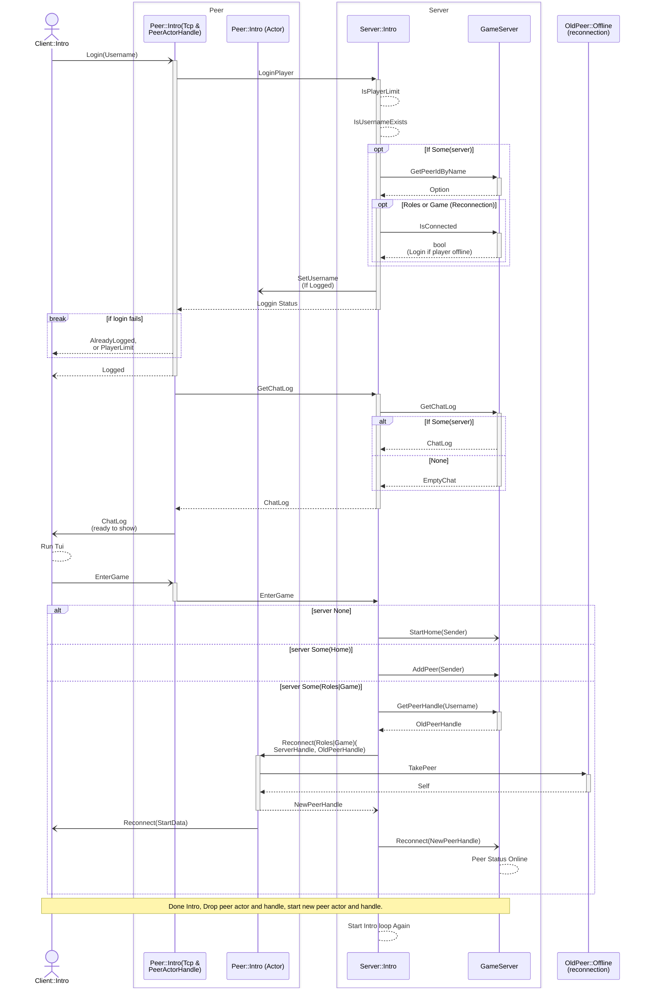
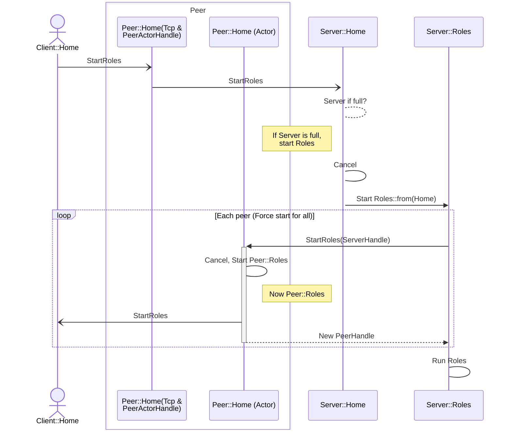
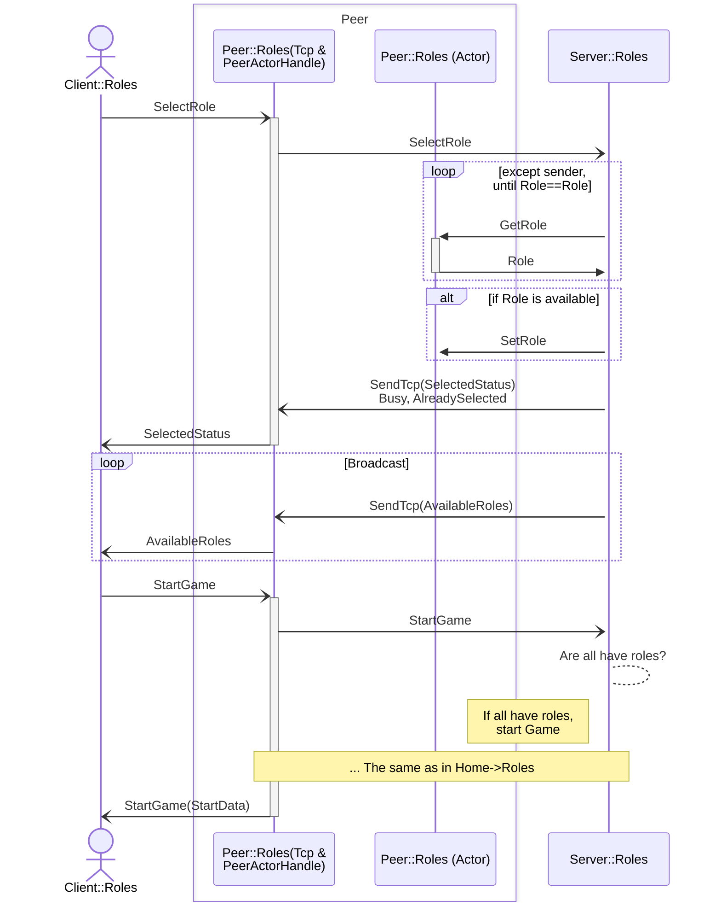

# Kobuleti

## State Machine

### Intro
Intro is a login and handshake state.

#### Sequence Diagram

### Home
Home is a Lobby server. 
#### Sequence Diagram

### Roles

#### Sequence Diagram

### Game

#### Sequence Diagram
