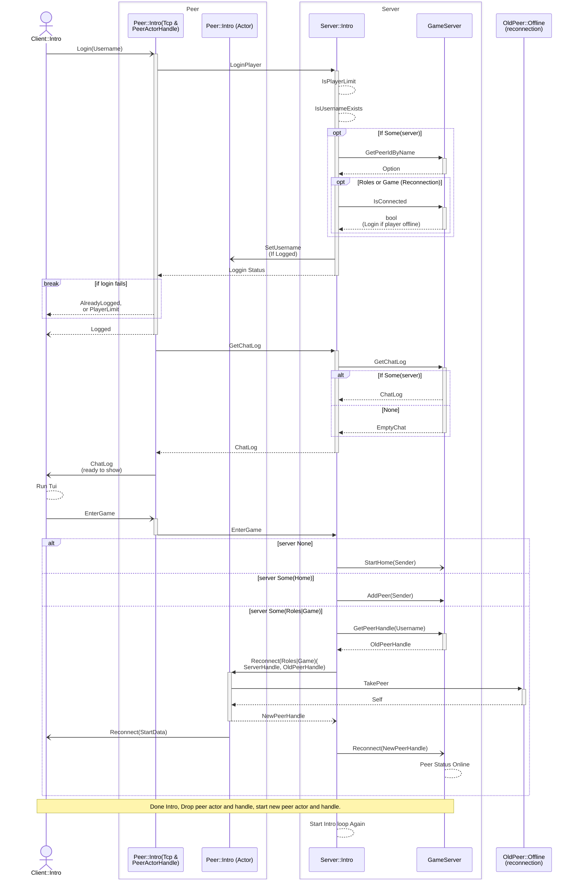
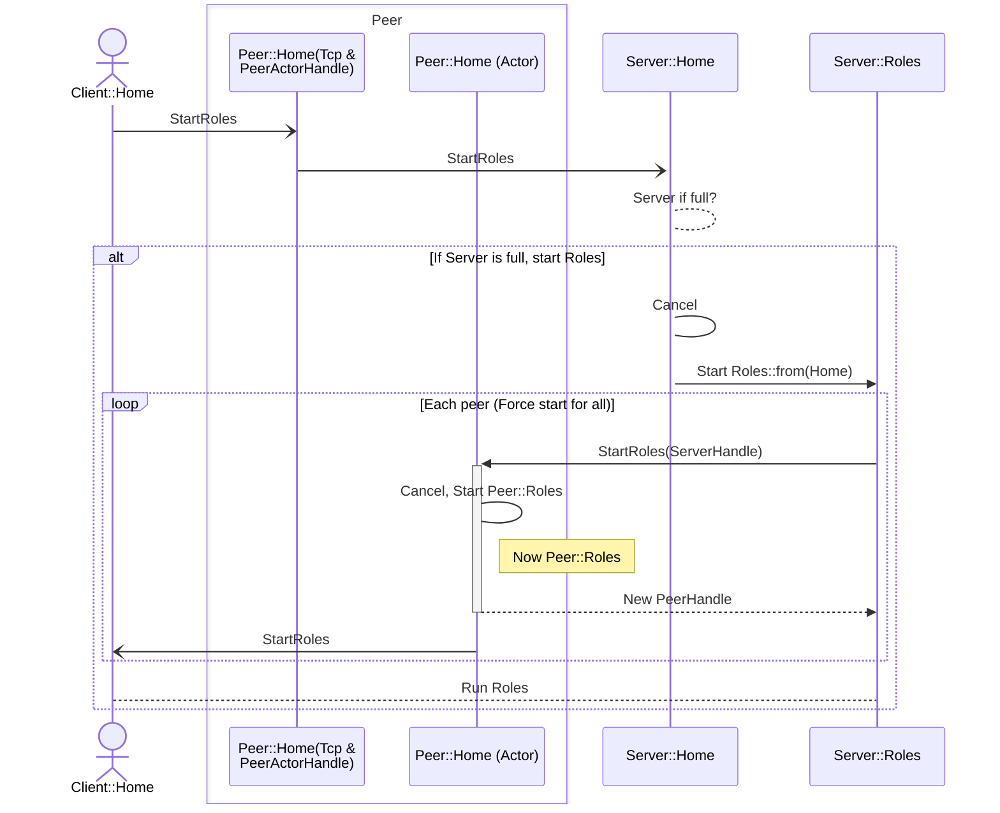
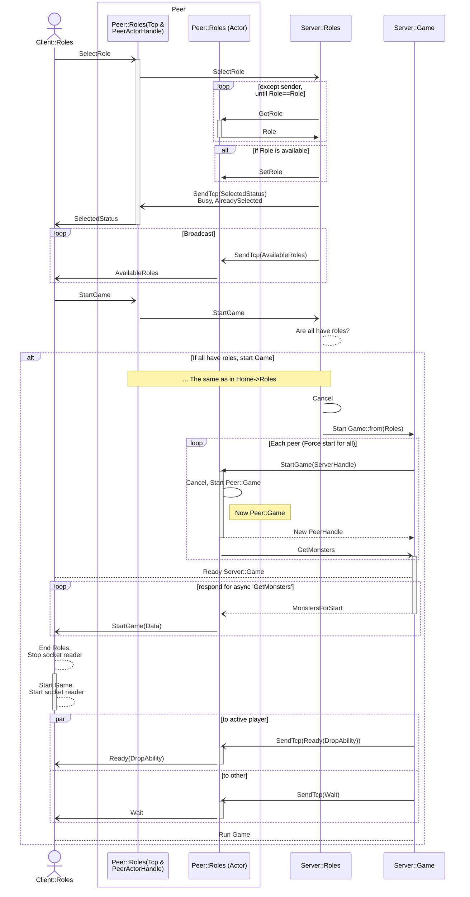
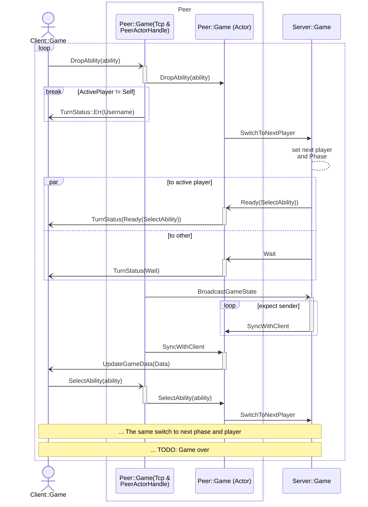

# kobuleti

## About 
`kobuleti` is an RPG game that revolves around playing cards. The game story is about the village of `Kobuleti`.  It draws inspiration from `Ascension` by game designer [Antony Ngo] which uses playing cards.

[Antony Ngo]: https://www.youtube.com/watch?v=NwLkOBRf1iM&ab_channel=AnthonyNgo

## Goals
The intent of this project was to initiate my experience in Rust and asynchronous web app development by creating this very personal game about a small Georgian village, where I was lucky to spend a summer. My girlfriend, Xenia, who worked on this game as an illustrator, and I wanted to share with the world a piece of this mysterious place named (სოფელი, '_sopeli_' in Georgian) `Kobuleti`.

## Key Features
- Terminal based (with [ratatui])
- State machine actors built with pure [tokio]
- Login (simple, only by username)
- Reconnection
- Chat (saving between reconnections, while a game session is running)
- 2 players multiplayer together against monsters
- Turn-based

[ratatui]: https://docs.rs/ratatui/latest/ratatui/
[tokio]: https://tokio.rs

## Gallery


## Implementation
The client-server communication is simple. It operates over TCP with *serde::json* and *tokio_util::codec::LinesCodec*, which divides a TCP stream by '_\0_'. A client app awaits for input or a TCP event before rendering a new state.

### Actors with Tokio
The server for this game is divided into different parts, each implemented as a tokio task: 
- `Peer` handles "_accept connection_" code. Task spawns for each connection.
- `States` manages the common server functionality and includes two tokio tasks: the Intro server and the game server.

The server does not use any Mutex or Rwlocks. Instead, it relies on the `Actor` pattern, as described in [Alice Ryhl]'s article [Actors with Tokio]. Communication between peer actors and the server actor is accomplished using _mpsc_ and _oneshot_ channels

[Actors with Tokio]: https://ryhl.io/blog/actors-with-tokio/

An actor is split into two parts: an *Actor* and an actor *Handle*. The Actor runs in own tokio task and listens on _tokio::mpsc::channel_ receiver. Other parts of the server use Handle to send enum messages and receive return value through _tokio::sync::oneshot::channel_.

The Peer handle is also used for accepting TCP connection messages and directing them to the appropriate peer actor or the server actor. This approach helps prevent potential infinite awaiting leaks.

To simplify the definition of the actor API, I've created a macro with an incremental tt-muncher.


```rust
actor_api! { // Peer::Intro
    impl  Handle<Msg<SharedCmd, IntroCmd>>{
        pub async fn set_username(&self, username: Username);
        pub async fn enter_game(&self, server: states::HomeHandle) -> Result<HomeHandle, RecvError>;
    }
}
```
The macro automatically defines inner enum and methods:
```rust
 enum IntroCmd {
    SetUsername(Username),
    EnterGame(tokio::sync::oneshot::Sender<HomeHandle>),
 }
impl Handle<Msg<SharedCmd, IntroCmd>> {
    pub async fn set_username(&self, username: Username){
        self.tx.send(Msg::State(IntroCmd::SetUsername(username)).expect("Open");
    }
    pub async fn enter_game(&self) -> Result<HomeHandle, RecvError>{
        let (tx, rx) = tokio::oneshot::channel();
        self.tx.send(Msg::State(IntroCmd::EnterGame(tx))).await.expect("Open");
        rx.await
    }
}
```


### State Machine
The game infrastructure is constructed using the State Machine pattern, which effectively segregates the logic for "Login," "Lobby," "Character Creation," and "Game" into distinct server states. It gives a clean API interface, undestandable code, safe and scalability. The transitions between states are described in article [State Machine Pattern] by [Ana Hoverbear]:


```rust
    // a pseudo code for describe state machine transitions:

    let intro = Context::<Intro>::default();
    run(&mut intro).await;
    let home = Context::<Home>::from(intro);
    run(&mut home).await;
    let roles = Context::<Roles>::from(home);
    run(&mut roles).await;
    let game = Context::<Game>::from(roles);
    run(&mut game).await;

```

[State Machine Pattern]: https://hoverbear.org/blog/rust-state-machine-pattern/

The server does not validate messages, it only parses enum types for each state. Now let's look into each states:

#### Intro
The `Intro` is a login state. In this state, clients can log in using their username and proceed to the next server (either a new lobby or a reconnection to a game in "Roles" or "Game" states). On the client side, after a successful login, the "Intro" state initiates a TUI and displays a start screen. If the login attempt fails, the application is rejected with an error.

##### Sequence Diagram



#### Home
The "Home" state functions as a lobby server where players wait for other players and chat. Reconnection is not allowed in this state.

##### Sequence Diagram



#### Roles
In the "Roles" state, players choose their RPG roles and start the game once all players are ready. This state allows reconnection if a player exits and reenters with the same username.

##### Sequence Diagram



#### Game
The "Game" state represents a game session with two players and allows reconnection. It manages player turns in a sequential manner.

##### Sequence Diagram




## Credits

- [Alice Ryhl]
- [Ana Hoverbear]
- [tokio and mini-redis project](https://github.com/tokio-rs/mini-redis)

[Alice Ryhl]: https://github.com/Darksonn/
[Ana Hoverbear]: https://github.com/hoverbear