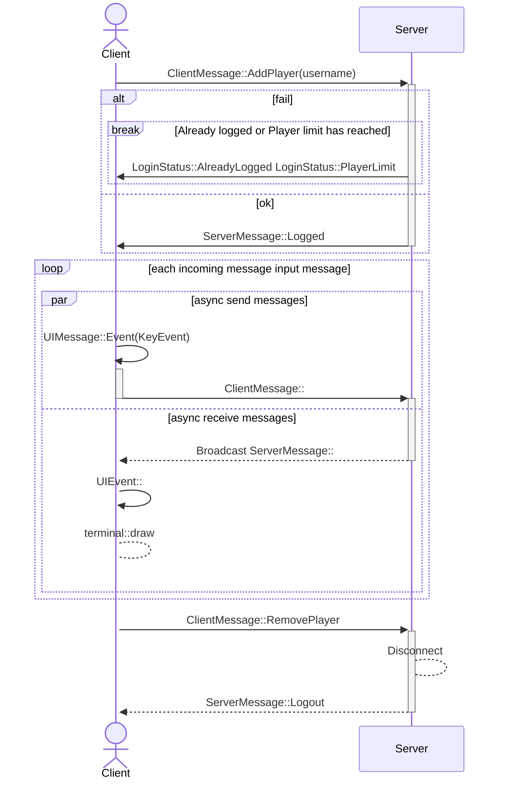

```mermaid
sequenceDiagram
    actor C as Client
    participant S as Server
    C->>+S: ClientMessage::AddPlayer(username)
    alt fail
        break Already logged or Player limit has reached
        S->>C: LoginStatus::AlreadyLogged LoginStatus::PlayerLimit
        end
    else ok
        S->>-C: ServerMessage::Logged
    end

    loop each incoming message input message
        par async send messages
            C->>+C: UIMessage::Event(KeyEvent)
            activate C
            C->>+S: ClientMessage::
            deactivate C
        and    async receive messages
            S-->>-C : Broadcast ServerMessage::
            C->>C : UIEvent::
            C-->C: terminal::draw
        end
    end
    C->>+S : ClientMessage::RemovePlayer
    S-->S : Disconnect
    S-->>-C : ServerMessage::Logout
    

    
```