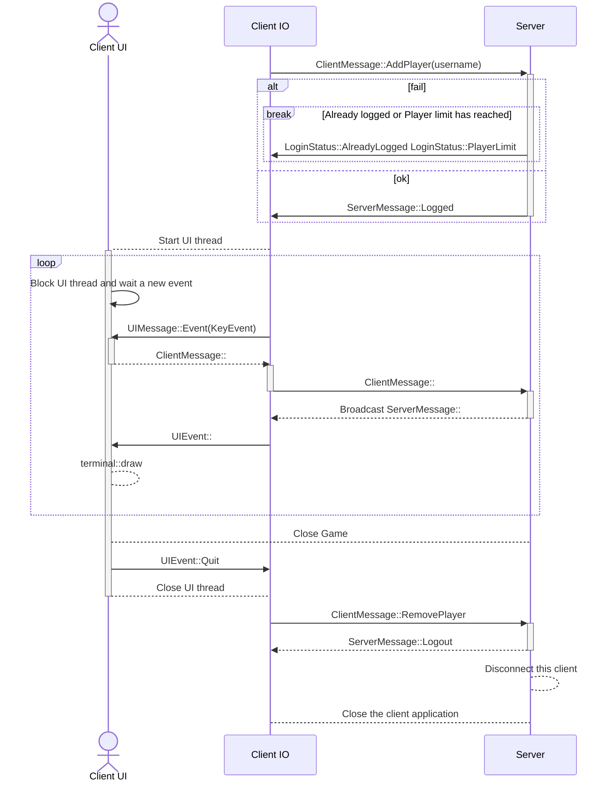

```mermaid
sequenceDiagram
    actor UI as Client UI
    participant C as Client IO
    participant S as Server
    C->>+S: ClientMessage::AddPlayer(username)
    alt fail
        break Already logged or Player limit has reached
        S->>C: LoginStatus::AlreadyLogged LoginStatus::PlayerLimit
        end
    else ok
        S->>-C: ServerMessage::Logged
    end
    C-->+UI: Start UI thread

    loop
        
        UI->>UI: Block UI thread and wait a new event
        C->>+UI: UIMessage::Event(KeyEvent)
        UI-->>-C: ClientMessage::
        activate C
        C->>+S: ClientMessage::
        deactivate C
        S-->>-C : Broadcast ServerMessage::
        C->>UI : UIEvent::
        UI-->UI: terminal::draw
    end
    UI-->S : Close Game
    UI->>C : UIEvent::Quit
    UI-->-C: Close UI thread
    C->>+S : ClientMessage::RemovePlayer
    S-->>-C : ServerMessage::Logout
    S-->S : Disconnect this client
    C-->S : Close the client application
    
```